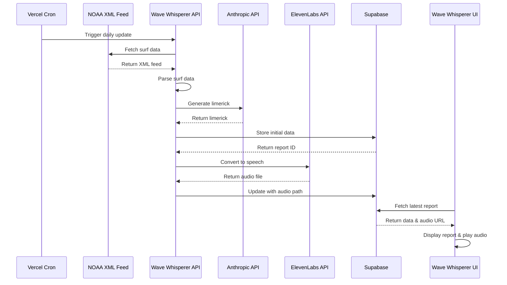

# &nbsp;&nbsp;Wave Whisperer

Wave Whisperer is a Next.js application that forecasts surf conditions by fetching data from NOAA, generating surf-themed limericks using Anthropic, and creating audio narrations with ElevenLabs. This project serves as an exploration of Anthropic's API capabilities, particularly focusing on multi-shot prompting techniques to generate context-aware, metered poetry from structured forecast data.

## Features

- **Daily Surf Data**: Fetches and parses surf data from NOAA's XML feed. [`noaa/client`](/lib/noaa/client.ts)
- **Limerick Generation**: Uses Anthropic's Claude to create surf-themed limericks based on NOAA discussions. Implements the persona-instruction-context prompting pattern, inspired by Chapter 6 of "Hands-on Large Language Models" (Alammar & Grootendorst). [`anthropic/client`](/lib/anthropic/client.ts) [`anthropic/generateSurfLimerick`](/lib/anthropic/generateSurfLimerick.ts)
- **Audio Narration**: Converts limericks into audio using ElevenLabs and stores them in Supabase. [`elevenlabs/client`](/lib/elevenlabs/client.ts)
- **Interactive 3D UI**: Features a physics-based crystal ball using Three.js, React Three Fiber, and Framer Motion for fluid animations and interactions. Includes real-time mesh deformation, dynamic lighting, and audio playback controls. [`CrystalBall`](/components/SurfReport/CrystalBall.tsx) [`WavyGrid`](/components/SurfReport/WavyGrid.tsx) [`AudioContext`](/components/SurfReport/AudioContext.tsx)



## Getting Started

To get started with Wave Whisperer, follow these steps:

### 1. Clone the Repository

First, clone the repository to your local machine and navigate into the project directory:

```bash
git clone https://github.com/taylorkmho/wavewhisperer.git
cd wavewhisperer
```

### 2. Install Dependencies

First ensure you have pnpm installed (`npm install -g pnpm` if you don't have it).

```bash
pnpm install
```

### 3. Set Up Environment Variables

Create a `.env` file in the root directory of the project. This file will store all the necessary environment variables required for the application to function correctly. Add the following variables:

- `CRON_SECRET`: Used to authenticate cron jobs for scheduled tasks.
- `ELEVENLABS_API_KEY`: API key for ElevenLabs to generate audio narrations.
- `ANTHROPIC_API_KEY`: API key for Anthropic's Claude to generate limericks.
- `SUPABASE_SERVICE_ROLE_KEY`: Service role key for Supabase, used for server-side operations requiring elevated permissions.
- `NEXT_PUBLIC_SUPABASE_URL` and `NEXT_PUBLIC_SUPABASE_ANON_KEY`: Public credentials for accessing Supabase, used for client-side operations.

### 4. Set Up Database

Using the Supabase dashboard or SQL editor, create the necessary database tables:

```sql
-- Create the surf_reports table
CREATE TABLE surf_reports (
    id UUID DEFAULT uuid_generate_v4() PRIMARY KEY,
    created_at TIMESTAMP WITH TIME ZONE DEFAULT timezone('utc'::text, now()) NOT NULL,
    last_build_date TEXT NOT NULL,
    discussion TEXT[] NOT NULL,
    wave_heights JSONB NOT NULL,
    raw_xml TEXT,
    poem TEXT[] NOT NULL,
    model TEXT NOT NULL,
    audio_path TEXT
);

-- Create the votes table with IP tracking
CREATE TABLE votes (
    id UUID DEFAULT uuid_generate_v4() PRIMARY KEY,
    created_at TIMESTAMP WITH TIME ZONE DEFAULT timezone('utc'::text, now()) NOT NULL,
    surf_report_id UUID REFERENCES surf_reports(id) NOT NULL,
    vote_type TEXT NOT NULL CHECK (vote_type IN ('up', 'down')),
    ip_address TEXT NOT NULL
);

-- Add constraint to ensure one vote per IP per report
ALTER TABLE votes
ADD CONSTRAINT unique_vote_per_ip_per_report
UNIQUE (surf_report_id, ip_address);

-- Create function to get client IP
CREATE OR REPLACE FUNCTION get_client_ip()
RETURNS text
LANGUAGE plpgsql
SECURITY DEFINER
AS $$
DECLARE
    headers json;
BEGIN
    headers := current_setting('request.headers', true)::json;

    IF headers->>'cf-connecting-ip' IS NOT NULL THEN
        RETURN headers->>'cf-connecting-ip';
    ELSIF headers->>'x-real-ip' IS NOT NULL THEN
        RETURN headers->>'x-real-ip';
    ELSIF headers->>'x-forwarded-for' IS NOT NULL THEN
        RETURN headers->>'x-forwarded-for';
    ELSE
        RETURN NULL;
    END IF;
END;
$$;

-- Create storage bucket for audio files
INSERT INTO storage.buckets (id, name, public)
VALUES ('voiceover', 'voiceover', true);

-- Set up storage policy for public access to audio files
CREATE POLICY "Public Access" ON storage.objects FOR SELECT USING (bucket_id = 'voiceover');
```

### 5. Run the Development Server

Start the development server to run the application locally:

```bash
pnpm dev
```

This command will start the Next.js development server, typically accessible at [http://localhost:3000](http://localhost:3000).

### 6. Open the Application

Visit [http://localhost:3000](http://localhost:3000) in your browser to view and interact with the application. You can explore the surf forecasts, listen to generated limericks, and enjoy the interactive UI.
